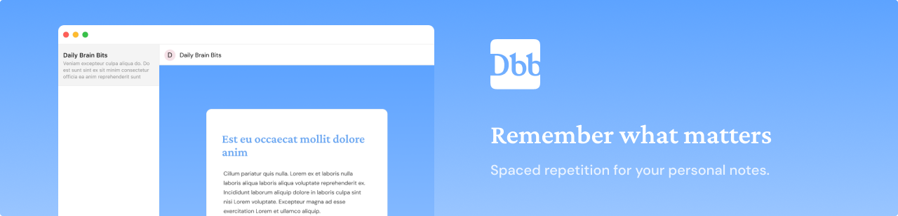
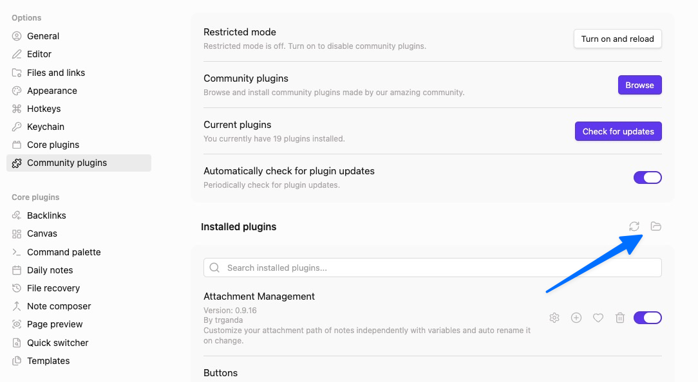
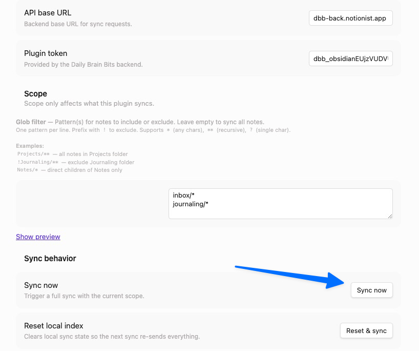

<div align="center">



# Daily Brain Bits

**Resurface your notes. Remember what matters.**

Spaced repetition for your personal knowledge base. Connect your notes, receive curated email digests, and actually remember what you've written.

[](LICENSE)
[](#self-hosting)
[](https://github.com/younesbenallal/daily-brain-bits/releases)

[Get Started](https://dbb.notionist.app) · [Self-Host](#self-hosting) · [Obsidian Plugin](#obsidian-plugin-setup)

</div>

---

## What is Daily Brain Bits?

You take notes. Lots of them. But how often do you actually revisit them?

Daily Brain Bits uses **spaced repetition** to surface your notes at the right time — so you remember what you've learned without the manual effort. Connect your note-taking app, and we'll send you curated email digests with a selection of your notes.

**How it works:**

1. **Connect** your note source (Obsidian or Notion)
2. **Sync** your notes to Daily Brain Bits
3. **Receive** personalized email digests (daily, weekly, or monthly)
4. **Remember** what you've written with optional AI-generated quizzes

---

## Features

- **Spaced Repetition** — Smart scheduling surfaces notes at optimal intervals for retention
- **Email Digests** — Receive curated notes delivered to your inbox
- **AI Quizzes** — Test your knowledge with auto-generated questions (Pro/Self-hosted)
- **Obsidian Support** — Push sync via our companion plugin
- **Notion Support** — OAuth integration with incremental sync
- **Glob Filters** — Control which notes get synced with pattern matching
- **Timezone-Aware** — Digests arrive at your preferred local time
- **Self-Hostable** — Run your own instance with Docker Compose

---

## Quick Start (Cloud)

The fastest way to get started:

1. **Sign up** at [dbb.notionist.app](https://dbb.notionist.app)
2. **Connect** your Obsidian vault or Notion workspace
3. **Configure** your digest frequency and delivery time
4. **Done!** Your first digest will arrive on schedule

---

## Obsidian Plugin Setup

The Obsidian plugin enables push-based sync from your vault to Daily Brain Bits.

### Installation

1. **Download** the latest plugin release from the [Releases page](https://github.com/younesbenallal/daily-brain-bits/releases)

2. **Locate your plugins folder:**
   - Open Obsidian
   - Go to **Settings** (`Cmd+,` on Mac, `Ctrl+,` on Windows/Linux)
   - Navigate to **Community plugins** in the sidebar
   - Click the **folder icon** to open your plugins directory

   

3. **Copy the plugin files** into a new folder called `daily-brain-bits`:

4. **Enable the plugin:**
   - Back in Obsidian Settings → Community plugins
   - Find "Daily Brain Bits" in the list
   - Toggle it **on**

### Configuration

1. Open **Settings** → **Daily Brain Bits** (in the sidebar)

   

2. **Enter your API token:**
   - Get your token from the [DBB dashboard](https://dbb.notionist.app/settings)
   - Paste it in the **API Token** field

3. **Configure filters** (optional):
   - Use glob patterns to include/exclude notes
   - Example: `**/*.md` syncs all markdown files
   - Example: `!**/templates/**` excludes the templates folder

4. **Hit Sync** to start the initial sync

   

After the initial sync, the plugin will automatically push changes as you edit your notes.

---

## Self-Hosting

Run your own Daily Brain Bits instance with full Pro features, unlimited notes, and complete data ownership.

### Requirements

- Docker & Docker Compose
- A [Resend](https://resend.com) account for email delivery
- (Optional) Notion OAuth credentials if you want Notion integration

### Quick Start

1. **Clone the repository:**
   ```bash
   git clone https://github.com/younesbenallal/daily-brain-bits.git
   cd daily-brain-bits
   ```

2. **Configure environment:**
   ```bash
   cp docker/app.env docker/app.env.local
   ```

   Edit `docker/app.env.local` and set:
   ```env
   BETTER_AUTH_SECRET=your-random-32-char-secret
   RESEND_API_KEY=re_xxxxx
   RESEND_FROM=digest@yourdomain.com
   ```

3. **Start the stack:**
   ```bash
   docker compose up --build
   ```

4. **Access the app:**
   - Frontend: `http://localhost:3000`
   - Backend: `http://localhost:3001`

### Architecture

```
┌─────────────┐     ┌─────────────┐     ┌─────────────┐
│   Frontend  │────▶│   Backend   │────▶│  Postgres   │
│   (nginx)   │     │   (bun)     │     │             │
└─────────────┘     └─────────────┘     └─────────────┘
      :3000              :3001               :5432
                              │
                              ▼
                    ┌─────────────┐
                    │    Cron     │
                    │  (digests)  │
                    └─────────────┘
```

### What's Included

- **All Pro features** enabled by default
- **Unlimited notes and sources**
- **AI quizzes** (bring your own LLM API keys)
- **Hourly cron** for digest delivery
- **Automatic schema migrations** on first boot

For detailed configuration options, see [docs/self-hosting.md](docs/self-hosting.md).

---

## Configuration

| Setting | Description | Options |
|---------|-------------|---------|
| **Digest Frequency** | How often you receive emails | Daily, Weekly, Monthly |
| **Delivery Time** | When digests arrive (your local time) | Any hour |
| **Notes per Digest** | Number of notes in each email | 1-10 |
| **Glob Filter** | Pattern to include/exclude notes | Glob syntax |

### Glob Filter Examples

```
**/*.md                    # All markdown files
!**/templates/**           # Exclude templates folder
**/projects/**/*.md        # Only notes in projects folder
!**/_*.md                  # Exclude files starting with underscore
```

---

## Plans

| Feature | Free | Pro ($10/mo) | Self-Hosted |
|---------|------|--------------|-------------|
| Notes | 500 | 10,000 | Unlimited |
| Sources | 1 | Unlimited | Unlimited |
| Daily Digests | - | ✓ | ✓ |
| Weekly/Monthly | ✓ | ✓ | ✓ |
| AI Quizzes | - | ✓ | ✓ |

---

## Contributing

Contributions are welcome! Here's how to get started:

1. Fork the repository
2. Create a feature branch: `git checkout -b feature/my-feature`
3. Make your changes
4. Run type checks: `bun type-check`
5. Run tests: `bun test`
6. Submit a pull request

Please read our contributing guidelines before submitting PRs.

---

## Tech Stack

- **Runtime:** Bun
- **Backend:** Hono, oRPC, Drizzle ORM
- **Frontend:** React 19, TanStack Router, Tailwind CSS v4
- **Database:** PostgreSQL
- **Email:** Resend
- **Auth:** Better Auth

---

## License

MIT License — see [LICENSE](LICENSE) for details.

---

<div align="center">

**[Website](https://notionist.app)** · **[GitHub](https://github.com/younesbenallal/daily-brain-bits)** · **[Releases](https://github.com/younesbenallal/daily-brain-bits/releases)**

Made with ☕ by [@younesbenallal](https://github.com/younesbenallal)

</div>
